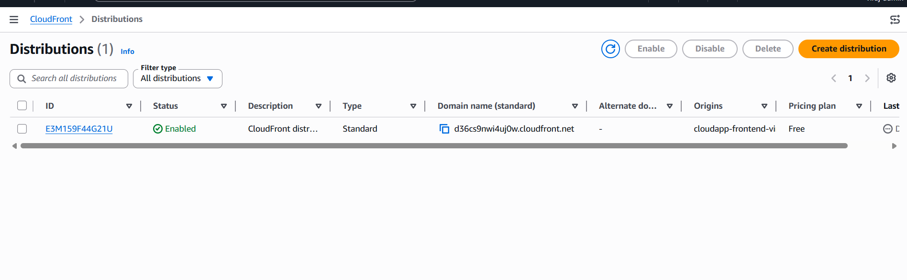
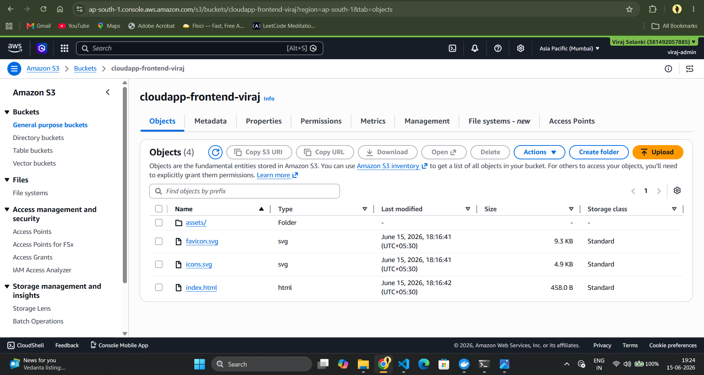
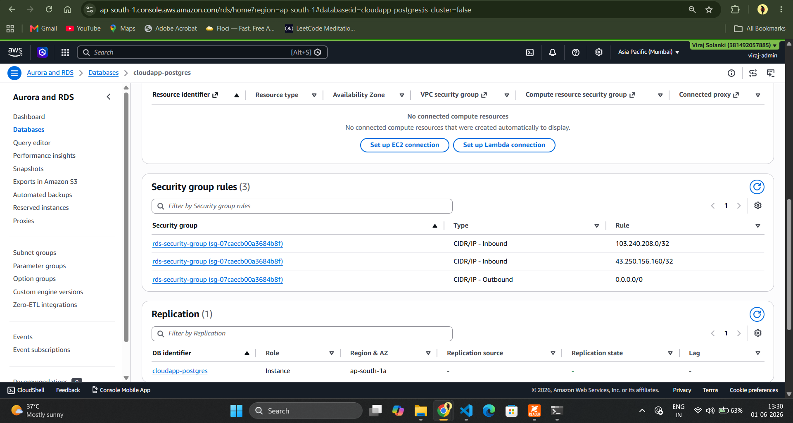
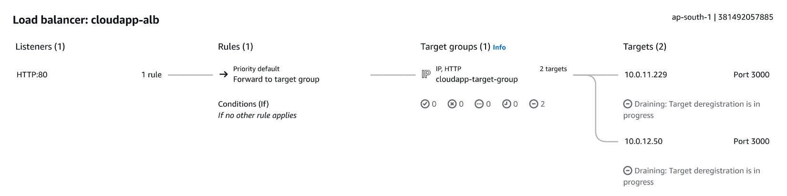

# Cloud-Native Full Stack Application on AWS


## Project Overview

This project is a production-style cloud-native full-stack application built as part of a practical Cloud Engineering and DevOps learning journey.

The overall purpose remains the same: building a production-style cloud-native full-stack application on AWS to learn Cloud Engineering, DevOps, Backend Development, Containerization, and Cloud Infrastructure. The project scope has expanded to include frontend deployment using Amazon S3 and CloudFront.

The application consists of:

* React + Vite Frontend
* Node.js + Express Backend
* PostgreSQL Database
* Docker Containerization
* AWS ECS Fargate Deployment
* AWS RDS PostgreSQL
* AWS ECR Container Registry
* AWS Application Load Balancer
* AWS CloudFront CDN
* AWS S3 Static Website Hosting

---

## High-Level Architecture

```text
                        Internet Users
                               │
                               ▼
                       CloudFront CDN
                               │
                               ▼
                     S3 Static React Frontend

                               │
                               ▼

                    Application Load Balancer
                               │
                               ▼
                        ECS Fargate Tasks
                               │
                               ▼
                        Amazon RDS PostgreSQL
```

---

## AWS Services Used

### Networking

* Amazon VPC
* Public Subnets
* Private Subnets
* Database Subnets
* Internet Gateway
* Route Tables
* Security Groups
* NAT Gateway (during deployment)

### Compute

* Amazon ECS Fargate
* Application Load Balancer

### Storage

* Amazon S3

### Database

* Amazon RDS PostgreSQL

### Container Services

* Amazon ECR

### Content Delivery

* Amazon CloudFront

### Monitoring

* Amazon CloudWatch

---

## Features

### Backend Features

* REST API Development
* Express.js Server
* PostgreSQL Integration
* Connection Pooling
* Centralized Error Handling
* Environment Variables
* Health Check Endpoint
* Logging Support

### Frontend Features

* React + Vite
* API Integration
* Dynamic Data Loading
* Error Handling
* Environment-Based Configuration
* Production React build using Vite
* Static hosting through Amazon S3
* CloudFront distribution
* SPA routing support

### Cloud Features

* Dockerized Backend
* ECS Fargate Deployment
* CloudFront CDN
* Private S3 Bucket with OAC
* Application Load Balancer
* CloudWatch Logging
* Origin Access Control (OAC)
* CloudFront cache invalidation
* Private S3 bucket access through CloudFront

---

## Implemented API Endpoints

### Health Check

```http
GET /health
```

### Fetch Items

```http
GET /api/items/getitems
```

### Create Item

```http
POST /api/items
```

### Metrics Endpoint

```http
GET /metrics
```

---

## Docker Implementation

### Backend Containerization

Implemented:

* Dockerfile
* Multi-layer image build
* Environment variable injection
* ECS-compatible container image

Docker is still used for:

* Backend containerization
* ECS deployment
* ECR image storage

### Image Storage

Images are stored in:

```text
Amazon Elastic Container Registry (ECR)
```

---

## ECS Deployment

Backend application deployed using:

* ECS Fargate
* Task Definitions
* ECS Services
* Target Groups
* Application Load Balancer
* CloudWatch Logs

Implemented:

* Health Checks
* Load Balancer Integration
* Container Lifecycle Management

---

## Database Deployment

Database hosted on:

```text
Amazon RDS PostgreSQL
```

Implemented:

* Private Database Access
* Security Group Restrictions
* Database Connectivity from ECS
* Seed Data Loading

---

## Frontend Deployment

Frontend hosted using:

```text
Amazon S3
+
Amazon CloudFront
```

Implemented:

* Production React Build
* Private S3 Bucket
* CloudFront Distribution
* Origin Access Control (OAC)
* Cache Invalidation
* SPA Routing Support
* React production build
* S3 static hosting
* CloudFront CDN distribution
* Private bucket configuration
* CloudFront troubleshooting

---

## Challenges Solved

### CloudFront Access Denied

Issue:

* CloudFront unable to access S3 objects

Solution:

* Configured Origin Access Control (OAC)
* Updated Bucket Policy

### React SPA Routing

Issue:

```text
No routes matched location "/index.html"
```

Solution:

* Configured Default Root Object
* Configured SPA-compatible routing

### Mixed Content Error

Issue:

```text
HTTPS Frontend
HTTP Backend
```

Result:

```text
Browser blocked API requests
```

Root Cause:

* ALB configured only with HTTP Listener (Port 80)

Future Solution:

* Route53
* ACM Certificate
* HTTPS Listener (443)
* SSL Termination

### CloudFront Cache Issues

* Implemented cache invalidation process

---

## Security Implementations

Implemented:

* Private S3 Bucket
* Origin Access Control (OAC)
* Security Groups
* Private ECS Networking
* Isolated Database Subnets
* Environment Variables
* Principle of Least Exposure
* Restricted bucket access through CloudFront only
* Security group isolation
* Private ECS deployment
* Private RDS deployment

---

## Screenshots

### Architecture Diagram


### CloudFront Distribution



### S3 Bucket



### ECS Cluster


### RDS PostgreSQL



### Application Load Balancer



### CloudWatch Logs


---

## Skills Demonstrated

### Cloud Engineering

* AWS Networking
* VPC Design
* Security Groups
* Subnet Design
* CloudFront
* S3
* ECS
* ECR
* RDS
* Amazon S3 Static Hosting
* Amazon CloudFront CDN
* Origin Access Control (OAC)
* CloudFront Cache Invalidation
* Frontend Production Deployment
* React SPA Routing in CloudFront
* Mixed Content Debugging
* CloudFront Security Configuration

### Backend Engineering

* Node.js
* Express.js
* REST APIs
* PostgreSQL
* Connection Pooling
* Error Handling

### DevOps

* Docker
* Containerization
* ECS Deployments
* CloudWatch Logging

### System Design

* Multi-Tier Architecture
* Load Balancing
* CDN Architecture
* Database Isolation
* Secure Networking

---

## Future Enhancements

* GitHub Actions CI/CD
* Terraform Infrastructure as Code
* Route53
* ACM Certificates
* HTTPS-enabled ALB
* CloudWatch Dashboards
* SNS Alerting
* Auto Scaling Policies
* WAF Integration
* Production Hardening

## Author

Viraj Solanki

B.Tech Computer Engineering

Cloud Engineering & DevOps Enthusiast

