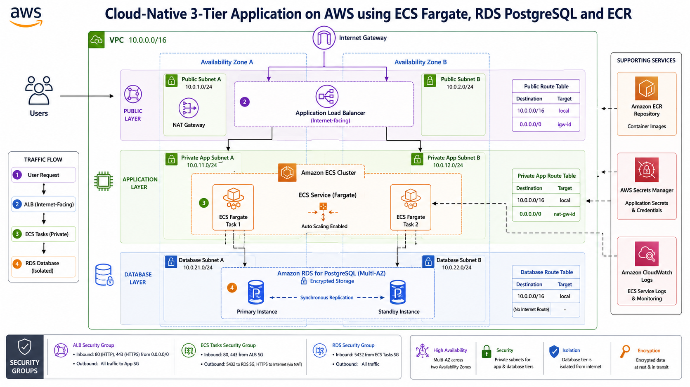
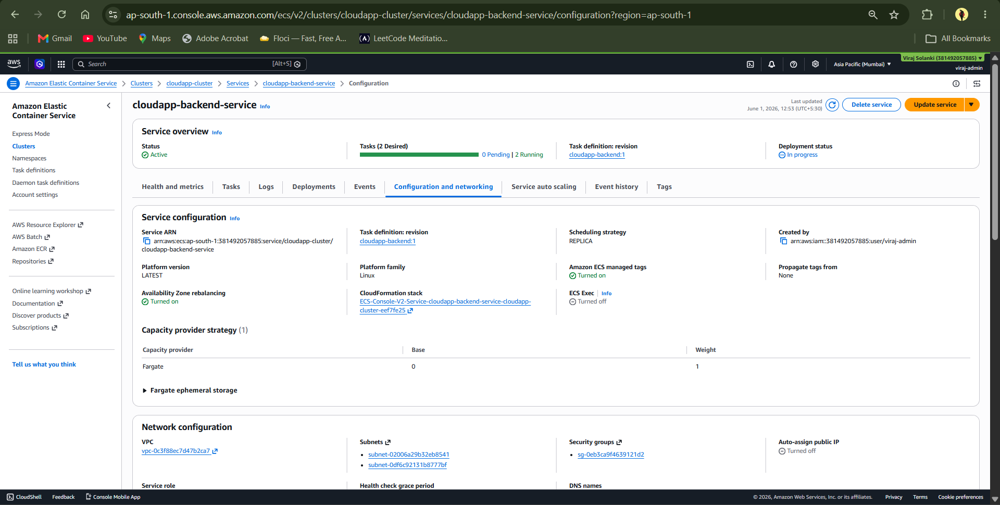
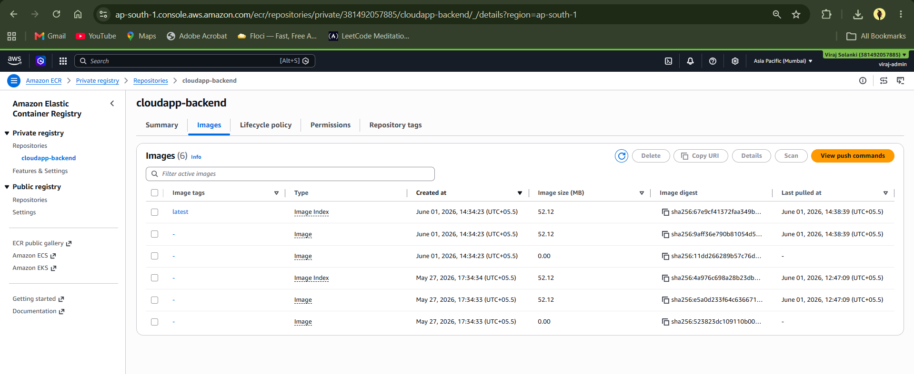
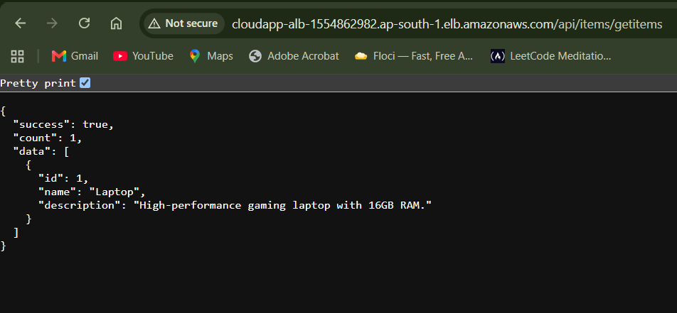
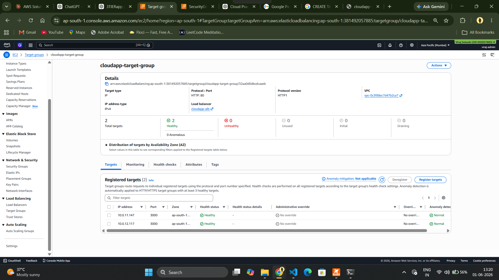
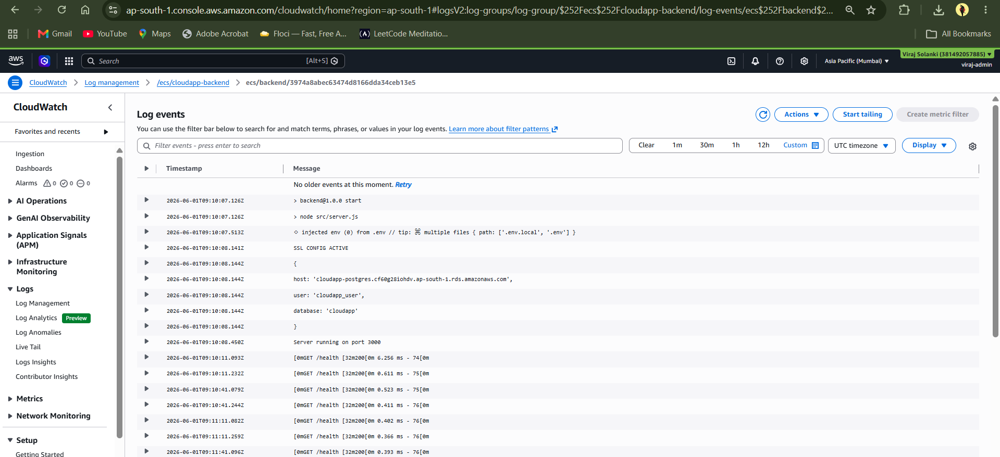

# Cloud-Native 3-Tier Application on AWS

## Overview

This project demonstrates the design and deployment of a production-style cloud-native 3-tier application on Amazon Web Services (AWS).

The application consists of:

* Frontend Layer (React)
* Backend Layer (Node.js + Express)
* Database Layer (PostgreSQL)

The backend is containerized using Docker and deployed on Amazon ECS Fargate. The database is hosted on Amazon RDS PostgreSQL. Application traffic is routed through an Application Load Balancer (ALB), while container images are stored in Amazon ECR.

The project was built to gain hands-on experience with cloud engineering, DevOps practices, containerization, networking, security, and production deployment workflows.

---

# Architecture



## High-Level Architecture

```text
Users
   │
   ▼
Application Load Balancer
   │
   ▼
Amazon ECS Fargate
   │
   ▼
Amazon RDS PostgreSQL
```

---

# AWS Services Used

| Service                   | Purpose                        |
| ------------------------- | ------------------------------ |
| Amazon ECS Fargate        | Container orchestration        |
| Amazon ECR                | Container image registry       |
| Amazon RDS PostgreSQL     | Managed relational database    |
| Application Load Balancer | Traffic distribution           |
| Amazon VPC                | Network isolation              |
| NAT Gateway               | Private subnet internet access |
| Internet Gateway          | Public internet connectivity   |
| IAM                       | Access management              |
| CloudWatch                | Monitoring and logging         |
| Secrets Manager           | Secure secret storage          |

---

# Features

### Backend

* REST API built with Express.js
* PostgreSQL integration
* Connection pooling
* Centralized error handling
* Environment-based configuration
* Health check endpoint
* Logging support

### Database

* PostgreSQL schema design
* Seed data support
* Secure database connectivity
* Managed by Amazon RDS

### Containerization

* Dockerized Node.js application
* Portable deployment
* Consistent environments

### Cloud Deployment

* ECS Fargate deployment
* Load balancing
* Health checks
* Private networking
* High availability architecture

---

# Project Structure

```text
cloud-native-3tier-app/
│
├── backend/
│   ├── src/
│   │   ├── controllers/
│   │   ├── routes/
│   │   ├── db/
│   │   ├── middleware/
│   │   └── app.js
│   │
│   ├── Dockerfile
│   ├── package.json
│   └── .env.example
│
├── frontend/
│   ├── src/
│   ├── public/
│   ├── Dockerfile
│   └── package.json
│
├── docs/
│   ├── architecture-diagram.png
│   ├── ecs-cluster.png
│   ├── rds-instance.png
│   ├── ecr-repository.png
│   ├── alb-target-group.png
│   └── cloudwatch-logs.png
│
└── README.md
```

---

# Networking Architecture

The application is deployed inside a custom Amazon VPC.

## VPC Layout

```text
VPC (10.0.0.0/16)

├── Public Subnet A
│   ├── ALB
│   └── NAT Gateway
│
├── Public Subnet B
│
├── Private App Subnet A
│   └── ECS Task
│
├── Private App Subnet B
│   └── ECS Task
│
├── Database Subnet A
│   └── RDS
│
└── Database Subnet B
    └── RDS
```

---

# ECS Deployment

## ECS Components

### ECS Cluster

Runs and manages application workloads.

### ECS Service

Maintains the desired number of running tasks.

### Task Definition

Defines:

* Docker image
* CPU
* Memory
* Port mappings
* Environment variables
* Logging configuration

### Fargate

Serverless compute engine used to run containers without managing EC2 instances.

---

# Database

## Amazon RDS PostgreSQL

Features:

* Managed PostgreSQL service
* Automated backups
* Security group protection
* Private subnet deployment
* Encryption support
* Multi-AZ ready architecture

---

# Security

Security best practices implemented:

* Private ECS tasks
* Private RDS instance
* Security-group-based access control
* Least-privilege IAM roles
* Secrets Manager integration
* No hardcoded credentials
* Network isolation through VPC design

---

# Monitoring

Amazon CloudWatch is used for:

* Container logs
* Application troubleshooting
* ECS monitoring
* Health-check verification

---

# Screenshots

## ECS Cluster



## ECR Repository



## Output JSON photo



## ALB Target Group



## CloudWatch Logs



---

# Learning Outcomes

Through this project I gained hands-on experience with:

* AWS ECS Fargate
* Amazon RDS PostgreSQL
* Amazon ECR
* Docker
* Application Load Balancer
* VPC Networking
* Public and Private Subnets
* Security Groups
* Route Tables
* NAT Gateway
* CloudWatch Logging
* Secrets Management
* Cloud Troubleshooting

---

# Challenges Solved

During implementation, several real-world issues were diagnosed and resolved:

* PostgreSQL authentication failures
* Security group misconfigurations
* Route table connectivity issues
* ECS task startup failures
* RDS connection problems
* SSL configuration issues
* Docker image deployment issues
* Health-check failures

These troubleshooting exercises provided practical cloud engineering experience beyond basic deployment.

---

# Future Improvements

Planned enhancements include:

* React frontend deployment
* Amazon S3 static hosting
* Amazon CloudFront CDN
* Auto Scaling policies
* HTTPS with ACM certificates
* Production monitoring dashboards
* Blue-Green deployments

---

# Resume Highlights

* Designed and deployed a cloud-native 3-tier application on AWS.
* Containerized Node.js backend using Docker.
* Deployed workloads using Amazon ECS Fargate.
* Integrated Amazon RDS PostgreSQL database.
* Configured Application Load Balancer and health checks.
* Implemented secure VPC networking using public and private subnets.
* Integrated CloudWatch logging and monitoring.
* Performed troubleshooting of networking, authentication, and deployment issues.

---

# Author

Viraj Solanki

B.Tech Computer Engineering

Cloud Engineering & DevOps Enthusiast
